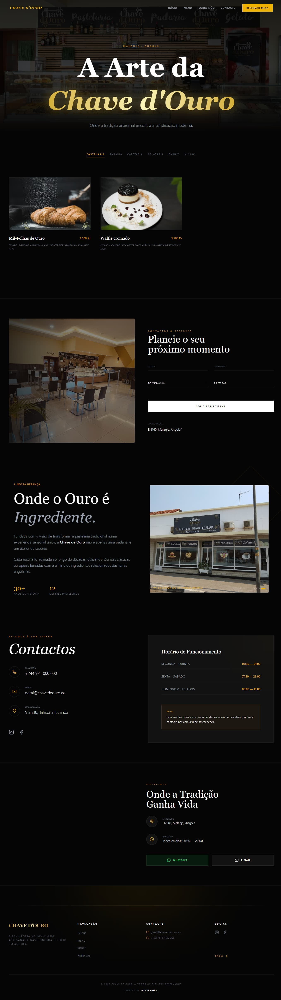

# 🗝️ Chave d'Ouro | Pastelaria & Restaurante de Luxo


Uma plataforma web premium desenvolvida para a **Chave d'Ouro**, localizada em Malanje, Angola. O projeto foca-se na fusão entre a tradição artesanal da pastelaria e uma experiência digital sofisticada e moderna.

## 💎 Visão do Projeto
O objetivo foi criar uma montra digital que transparecesse o conceito "high-end" da marca. A interface utiliza um **Dark Mode** profundo com detalhes em **Ouro Metálico**, garantindo elegância e destaque visual para os produtos artesanais.


.jpg)
---

## 🛠️ Tecnologias Utilizadas
*   **React 19:** Utilização das funcionalidades mais recentes para uma performance otimizada.
*   **TypeScript:** Tipagem estrita para garantir um código robusto e livre de erros em tempo de execução.
*   **Tailwind CSS v4:** Estilização utilitária avançada para um design responsivo e fluído.
*   **Framer Motion:** Animações de entrada e interações de scroll de alta fidelidade.
*   **Lucide React:** Iconografia minimalista e consistente.

---

## ✨ Funcionalidades Principais
*   **Hero Section Imersiva:** Fundo dinâmico com otimização de imagem (WebP) e overlays de gradiente para foco tipográfico.
*   **Arquitetura "Clean Code":** Aplicação de princípios de *Early Return* e componentização modular para facilitar a manutenção.
*   **Performance Otimizada:** Imagens processadas via Squoosh para garantir carregamento instantâneo, essencial para o mercado de Malange/Angola.
*   **Design Responsivo:** Adaptado meticulosamente para dispositivos móveis e desktops de alta resolução.

---

## 🚀 Como Executar o Projeto

1.  **Clone o repositório:**
    ```bash
    git clone [https://github.com/GelsonManuel/chave-douro.git](https://github.com/GelsonManuel/chave-douro.git)
    ```
2.  **Instale as dependências:**
    ```bash
    npm install
    ```


## 👨‍💻 Desenvolvedor
**Gelson Manuel**
*   Web Developer & Aspiring Freelancer baseado em Angola.
*   Especialista em React, TypeScript e interfaces de alta fidelidadeEste.

> **Nota:** Este projeto faz parte de um portfólio profissional focado em captar clientes de alto valor no setor de restauração e retalho angolano.